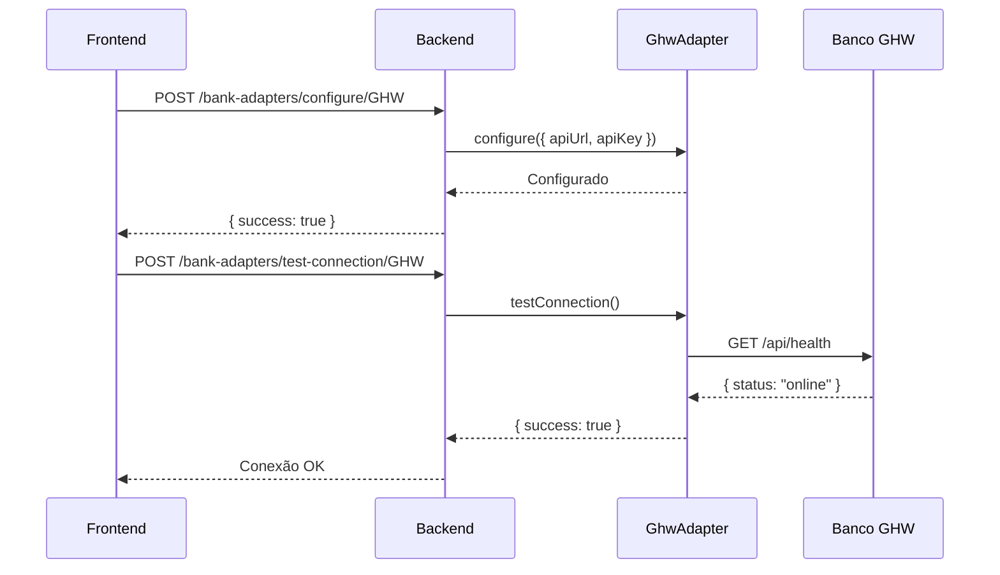

# 🔗 Guia de Integração de APIs Bancárias - PayJA

## 📋 Visão Geral

Este documento descreve como PayJA integra com bancos parceiros e como adicionar novos bancos.

## 🏗️ Arquitetura de Integração

PayJA usa um padrão de **adaptadores universais** que permite integrar qualquer banco sem modificar o código central.

### Fluxo de Integração

```
USSD (*898#, *899#)
    ↓
UssdService / RegistrationUssdService
    ↓
BankAdaptersService
    ↓
UniversalBankAdapter
    ↓
Banco API (HTTP)
```

## 🏦 Bancos Dinâmicos via `bank_partners` Table

Todos os bancos são configuráveis via banco de dados. Não é necessário recompilar.

### Schema da Tabela

```sql
CREATE TABLE bank_partners (
  code TEXT PRIMARY KEY,              -- ex: 'GHW', 'BCI', 'EMOLA'
  name TEXT NOT NULL,                 -- ex: 'Banco GHW'
  apiUrl TEXT NOT NULL,               -- ex: 'http://localhost:4000'
  apiKey TEXT,                        -- chave API se necessário
  active BOOLEAN DEFAULT true,
  healthEndpoint TEXT,                -- customizável: /api/health
  eligibilityEndpoint TEXT,           -- customizável: /api/validacao/verificar
  capacityEndpoint TEXT,              -- customizável: /api/capacidade/consultar
  disbursementEndpoint TEXT,          -- customizável: /api/desembolso/executar
  loansEndpoint TEXT,                 -- customizável: /api/emprestimos/consultar
  webhookEndpoint TEXT,               -- customizável: /api/webhooks/pagamento
  timeout INT DEFAULT 30000,
  retryAttempts INT DEFAULT 3,
  createdAt TIMESTAMP DEFAULT NOW(),
  updatedAt TIMESTAMP DEFAULT NOW()
);
```

## 🔌 APIs Esperadas do Banco

### 1. Health Check
**GET /api/health**

Verifique se o banco está online.

```json
Response:
{
  "status": "online",
  "timestamp": "2025-12-09T08:00:00Z"
}
```

### 2. Verificar Elegibilidade
**POST /api/validacao/verificar**

Headers:
```
x-api-key: banco-ghw-api-key-2025
Content-Type: application/json
```

Request:
```json
{
  "nuit": "100234567",
  "nome": "João Pedro da Silva",
  "bi": "1234567890123N",
  "telefone": "258841234567",
  "valor_solicitado": 5000
}
```

Response (Aprovado):
```json
{
  "sucesso": true,
  "elegivel": true,
  "cliente": {
    "nuit": "100234567",
    "nome": "João Pedro da Silva",
    "numero_conta": "0001000000001",
    "score_credito": 750,
    "renda_mensal": 35000
  },
  "limite_aprovado": 50000,
  "score_comparacao": 85,
  "taxa_juros": 12.5,
  "prazo_maximo": 36
}
```

Response (Rejeitado):
```json
{
  "sucesso": true,
  "elegivel": false,
  "motivo": "Dados não conferem com registros do banco",
  "codigo": "DADOS_INCONSISTENTES",
  "score_comparacao": 45
}
```

### 3. Consultar Capacidade
**POST /api/capacidade/consultar**

Request:
```json
{
  "nuit": "100234567",
  "valor_necessario": 5000
}
```

Response:
```json
{
  "sucesso": true,
  "cliente_elegivel": true,
  "capacidade_disponivel": 50000,
  "valor_pode_emprestar": true
}
```

### 4. Executar Desembolso
**POST /api/desembolso/executar**

Request:
```json
{
  "nuit": "100234567",
  "valor": 5000,
  "numero_emola": "825555555",
  "referencia_payja": "PAYJA-20251209-001"
}
```

Response:
```json
{
  "sucesso": true,
  "id_transacao": "uuid-12345",
  "status": "PROCESSADO",
  "valor_desembolsado": 5000,
  "tempo_processamento_ms": 1234
}
```

### 5. Webhook de Confirmação (Opcional)
**POST /api/webhooks/pagamento**

O banco envia para PayJA confirmar pagamento:

Request:
```json
{
  "referencia_payja": "PAYJA-20251209-001",
  "status": "PAGO",
  "data_pagamento": "2025-12-09T08:30:00Z",
  "valor_pago": 5000
}
```

## 📝 Adicionar Novo Banco

### Passo 1: Registrar no Dashboard
Acesse http://localhost:5173 → Integrações → Bancos Parceiros

Formulário:
```
Código: BCI
Nome: Banco de Crédito e Investimentos
URL da API: http://api.bci.co.mz
API Key: sua-chave-aqui
Endpoints:
  Health: /api/health
  Elegibilidade: /api/validacao/verificar
  Desembolso: /api/desembolso/executar
Timeout: 30000 ms
Retry: 3 tentativas
```

Clique "Adicionar Banco" → Banco ativado automaticamente

### Passo 2: Testar Conexão
Dashboard → Integrações → Bancos → BCI → Teste Conexão

Sistema testará:
- ✅ Conectividade HTTP
- ✅ API Key válida
- ✅ Health endpoint respondendo
- ✅ Eligibility endpoint respondendo

### Passo 3: Usar em USSD
Próximo registro/empréstimo buscará automaticamente todos bancos ativos.

PayJA loop:
1. Para cada banco ativo
2. Chama checkEligibility
3. Se score >= 70%: aprova
4. Usa limite do banco

## 🔐 Segurança

### API Keys
- Criptografadas em repouso no banco de dados
- Enviadas via headers HTTP apenas (nunca em URL)
- Rotação recomendada a cada 90 dias

### Validação
- Todos dados comparados (NUIT, Nome, BI)
- Score mínimo de 70% para aprovação
- Timeout de 30s para evitar travamentos
- Retry automático em falhas de rede

### Logs
Todas operações registram:
- NUIT do cliente
- Banco consultado
- Score obtido
- Resposta (aprovado/rejeitado)
- Tempo de processamento

Acessíveis em: Dashboard → Integrações → Logs

## 🧪 Teste com Banco-Mock

Para desenvolvimento, use o Banco-Mock incluído.

Inicie:
```powershell
cd banco-mock/backend
node src/index.js
```

Registre em PayJA:
- Code: GHW
- URL: http://localhost:4000
- API Key: banco-ghw-api-key-2025

Teste com clientes pré-carregados:
| NUIT | Nome | Limite |
|------|------|--------|
| 100234567 | João Pedro da Silva | 50.000 |
| 100345678 | Maria Santos Machado | 30.000 |
| 100456789 | Carlos Alberto Mondlane | 80.000 |

## 🚀 Exemplos Reais

### Integrar Emola
```
Code: EMOLA
URL: https://api.emola.co.mz/v2
API Key: sua-chave-emola
Endpoints:
  Elegibilidade: /clients/verify
  Desembolso: /disbursement/request
```

### Integrar BCI
```
Code: BCI
URL: https://api.bci.co.mz
API Key: sua-chave-bci
Endpoints:
  Elegibilidade: /lending/check-eligibility
  Desembolso: /lending/disburse
```

### Integrar Standard Bank
```
Code: STB
URL: https://api.standardbank.co.mz
API Key: sua-chave-stb
Endpoints:
  Elegibilidade: /eligibility/verify
  Desembolso: /loans/disburse
```

## 📞 Suporte

Para dúvidas sobre integração, consulte:
- [Documentação de Estrutura](./ESTRUTURA.md)
- [Integração Universal](./INTEGRACAO_UNIVERSAL.md)
```env
# Banco GHW
GHW_API_URL="http://localhost:4500"
GHW_API_KEY="banco-ghw-api-key-2025"
```

## 🎨 Estrutura Frontend

### 1. **Página de Integrações** (`desktop/src/pages/IntegrationsPage.jsx`)

A página carrega automaticamente todos os bancos disponíveis:

```jsx
const loadIntegrations = async () => {
  const response = await api.get('/bank-adapters/available-banks');
  setBanks(response.data);
};
```

### 2. **Configurar Banco**

```jsx
const saveBankConfig = async (bankCode, values) => {
  await api.post(`/bank-adapters/configure/${bankCode}`, {
    apiUrl: values.apiUrl,
    apiKey: values.apiKey,
  });
};
```

### 3. **Testar Conexão**

```jsx
const testBankConnection = async (bankCode) => {
  const response = await api.post(
    `/bank-adapters/test-connection/${bankCode}`
  );
  
  if (response.data.success) {
    message.success('Conexão estabelecida!');
  }
};
```

## 📡 Endpoints da API PayJA

### Bancos

| Método | Endpoint | Descrição |
|--------|----------|-----------|
| `GET` | `/bank-adapters/available-banks` | Lista bancos disponíveis |
| `POST` | `/bank-adapters/configure/:bankCode` | Configura API do banco |
| `POST` | `/bank-adapters/test-connection/:bankCode` | Testa conexão |
| `POST` | `/bank-adapters/check-eligibility/:bankCode` | Verifica elegibilidade |
| `POST` | `/bank-adapters/disburse` | Solicita desembolso |

## 🏦 APIs que o Banco DEVE Implementar

### 1. **Health Check**
```
GET /api/health
```
Retorna status do sistema bancário.

### 2. **Validação de Elegibilidade**
```
POST /api/validacao/verificar

Request:
{
  "nuit": "100234567",
  "nome": "João Silva",
  "telefone": "258841234567",
  "bi": "1234567890123N",
  "valor_solicitado": 10000
}

Response:
{
  "sucesso": true,
  "elegivel": true,
  "limite_aprovado": 50000,
  "cliente": {
    "nuit": "100234567",
    "nome": "João Silva",
    "numero_conta": "0001000000001",
    "score_credito": 750,
    "renda_mensal": 35000
  }
}
```

### 3. **Capacidade Financeira**
```
POST /api/capacidade/consultar

Request:
{
  "nuit": "100234567",
  "telefone": "258841234567"
}

Response:
{
  "sucesso": true,
  "capacidade_financeira": {
    "renda_mensal": 35000,
    "divida_total": 5000,
    "capacidade_pagamento_mensal": 9000,
    "limite_credito_aprovado": 50000
  }
}
```

### 4. **Executar Desembolso**
```
POST /api/desembolso/executar

Request:
{
  "nuit": "100234567",
  "valor": 10000,
  "numero_emola": "258841234567",
  "referencia_payja": "LOAN-12345",
  "descricao": "Desembolso empréstimo PayJA"
}

Response:
{
  "sucesso": true,
  "desembolso": {
    "id": "uuid-xxx",
    "valor": 10000,
    "status": "PROCESSANDO"
  }
}
```

### 5. **Consultar Empréstimos**
```
POST /api/emprestimos/consultar

Request:
{
  "nuit": "100234567"
}

Response:
{
  "sucesso": true,
  "emprestimos": {
    "total": 2,
    "ativos": 1,
    "lista": [...]
  }
}
```

### 6. **Webhook de Pagamento (Receber)**
```
POST /api/webhooks/pagamento

Request (vem do PayJA):
{
  "nuit": "100234567",
  "numero_emprestimo": "EMP-123",
  "valor_pago": 5000,
  "data_pagamento": "2025-12-08",
  "referencia": "PAY-456"
}
```

## 🔄 Fluxo de Integração



## ✅ Checklist para Adicionar Novo Banco

- [ ] Criar adaptador em `backend/src/modules/bank-adapters/adapters/`
- [ ] Implementar métodos: `configure()`, `testConnection()`, `checkEligibility()`, `requestDisbursement()`
- [ ] Adicionar provider no `bank-adapters.module.ts`
- [ ] Injetar no construtor do `bank-adapters.service.ts`
- [ ] Registrar no Map de adaptadores
- [ ] Adicionar em `getAvailableBanks()`
- [ ] Configurar variáveis de ambiente no `.env`
- [ ] Testar integração no frontend (Página Integrações)

## 🎯 Exemplo Completo: Banco GHW

✅ **Backend:**
- `adapters/ghw.adapter.ts` - Criado
- `bank-adapters.module.ts` - Registrado
- `bank-adapters.service.ts` - Adicionado ao Map
- `.env` - Configurado

✅ **Frontend:**
- `IntegrationsPage.jsx` - Atualizado
- Suporte para configuração dinâmica
- Teste de conexão funcional
- Documentação de endpoints

✅ **Banco Mock:**
- Backend rodando em `localhost:4500`
- Todas as APIs implementadas
- Frontend administrativo disponível

## 🚀 Como Usar

1. **Acessar Integrações**: `Desktop > Integrações > Aba Bancos`
2. **Configurar Banco GHW**:
   - URL: `http://localhost:4500`
   - API Key: `banco-ghw-api-key-2025`
3. **Testar Conexão**: Clicar em "Testar Conexão"
4. **Salvar**: Configuração salva automaticamente

---

**Documentação atualizada em:** 8 de Dezembro de 2025
